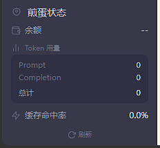
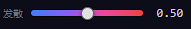
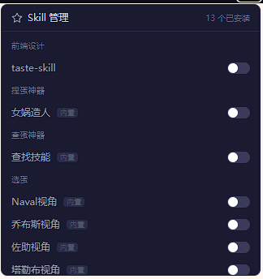
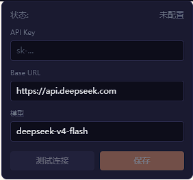
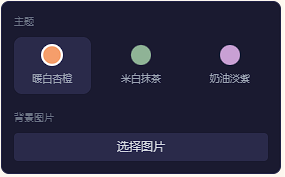

<div align="center">

# 🍳 煎蛋Agent

一款基于 DeepSeek API 的 AI 桌面助手，具备技能扩展、工具调用、行为分析和项目协作能力。

<p align="center">
  <a href="#-技能-skill-管理系统">技能系统</a> •
  <a href="#-侧栏状态面板">状态面板</a> •
  <a href="#-对话行为分析">行为分析</a> •
  <a href="#-快速开始">快速开始</a>
</p>


</div>

---

## 亮点特色

### 🧩 技能（Skill）管理系统

可插拔的技能架构，让 AI 的行为按需切换：

- **Prompt 型技能**：注入 AI 的思维框架，内置乔布斯、马斯克、费曼等 7 种人物视角 + 项目脚手架 + 调试流程 + 查找技能 + 女娲造人，用户在 UI 中自由勾选启用
- **Function 型技能**：22 个内置工具（文件读写、搜索、Shell 命令、Git 操作、代码审查等），AI 在对话中自动调用
- **UI 管理**：左侧栏弹出面板，按分类分组展示，一键 toggle 开关
- **可扩展**：新增技能只需在 `.skills/` 下创建 JSON 配置 + SKILL.md 内容文件，无需改代码
- **持久化打包**：技能文件打包到 exe 内，首次启动自动释放

> 对比传统 AI 聊天工具的把 prompt 写死在代码里，这套系统让 AI 的行为像插件一样灵活组合。

### 📊 侧栏状态面板

固定在左侧栏底部的实时监控面板（StatsSection），关键数据一目了然：

- **API 余额**：实时显示 DeepSeek 账户余额（60 秒缓存，避免频繁请求）
- **Token 用量**：累计统计 Prompt / Completion / 总计 Token
- **缓存命中率**：颜色标识高低（绿色=高，黄色=中，红色=低）
- **自动刷新**：每 10 秒轮询，数据持久化到 `stats.json`
- **悬浮小窗**：独立的 Electron 置顶窗口，可随时查看

### 🔬 对话行为分析

基于 LLM 驱动的三层分析体系，不只是记录日志：

1. **前置意图评估**（事前）：
   - AI 回复前同步分析用户问题的深层意图、行为特征
   - 结果注入消息上下文，指导 AI 更有针对性地回答
   - 不污染 system prompt，保护 KV 缓存命中率

2. **后置 Q&A 评估**（事后）：
   - 每轮对话完成后异步分析问答质量
   - 对比"原始问题 vs 理解后问题"——**这是目前行业空白**
   - 满意度评级 + 行为特征分析 + 原因说明
   - 结果存入 `analysis/user_behavior.md`

3. **综合报告**（长期）：
   - 每 10 条记录自动生成阶段摘要
   - 每 100 条记录生成用户画像分析
   - 每天 22:00 自动生成日报（满意度趋势 + 行为洞察 + 改进建议）

> 传统分析告诉你"用户点了什么"，这套分析告诉你"用户在想什么"。

---

## 更多功能

| 功能 | 说明 |
|------|------|
| **AI 对话** | 流式 SSE 输出，多轮对话，历史管理 |
| **图片识别** | 双引擎：模型原生视觉 + OCR 兜底 |
| **文档解析** | PDF / Word（含表格）/ Excel 上传解析 |
| **项目资源管理器** | 左侧文件树 + 右侧文件查看器，20+ 文件类型图标 |
| **多主题配色** | warm / mint / lavender 三套完整色系 |
| **自定义背景** | 支持上传任意图片作为界面背景 |
| **温度滑块** | 顶部栏常驻，实时调节 AI 创造性（0~1） |
| **对话记忆封装** | 三层记忆架构，20 轮对话省 70% token |
| **API 配置** | 内置配置面板，支持连接测试 |
| **桌面原生** | 无边框窗口，全栏可拖动，系统托盘，悬浮状态小窗 |

---

## 截图

| | | |
|:-:|:-:|:-:|
|  |  |  |
| 主界面与 API 状态 | 温度/发散控制 | 技能管理面板 |
|  |  | |
| API 配置界面 | 主题切换与背景设置 | |

---

## 快速开始

### 前置要求

- Python 3.9+
- Node.js 18+
- DeepSeek API Key

### 安装

```bash
# 后端
cd backend
pip install -r requirements.txt

# 前端
cd ../frontend
npm install
```

### 配置

在应用内点击顶部栏 API 状态图标配置 API Key、Base URL、Model，或直接在 `backend/config.json` 中填写。

### 启动开发服务器

```bash
cd frontend
npm run dev:server
```

访问 http://localhost:5173

### 打包桌面应用

```bash
cd frontend
npm run build    # 前端构建
npm run pack     # PyInstaller + electron-builder
```

---

## 技术栈

| 层 | 技术 |
|------|------|
| 前端 | React 19 + TypeScript + Vite 8 + Tailwind CSS v4 |
| 后端 | FastAPI + SQLAlchemy + OpenAI SDK + APScheduler |
| 桌面 | Electron 33 + electron-builder |
| 数据库 | SQLite |

---

<div align="center">


**交流反馈 · 扫码联系**

</div>
